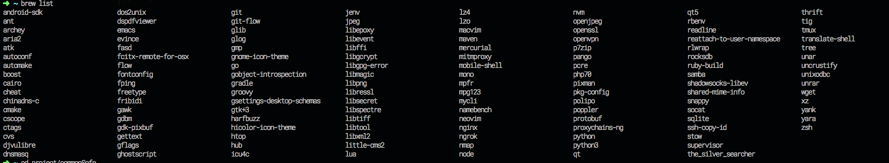

# commonSofe for mac

## Application
* ~~Apptivate~~ 键盘开启app,自带的automator也可以
* Spark  跟上面Apptivate不知道哪个好呢？mac 
* Shortcat 键盘操作电脑
* Spectacle 窗口控制
* Alfred
* HyperSwitch
* MacPass ( MacPassHTTP)
* dbeaver-enterprise
* Karabiner 我主要用来改变keyRepeat 的
* keka 压缩文件
### brew cask 安装的

## terminal
* supervisor
* zsh
* tmux
* oh-my-zsh
* ss chinsdns dnsmasq polipo kcptun
* aria2
* ag
* ~~the_silver_search~~ ag 代替了
* ngrok 穿透内网
* nginx
* jenv renv  

##命令
* open
* 直接改图片后缀名 自动转换
* echo | base64 -D
* screencapture
* pbcopy pbpaste
* mdfind
* say
* launctl
* diskutil
